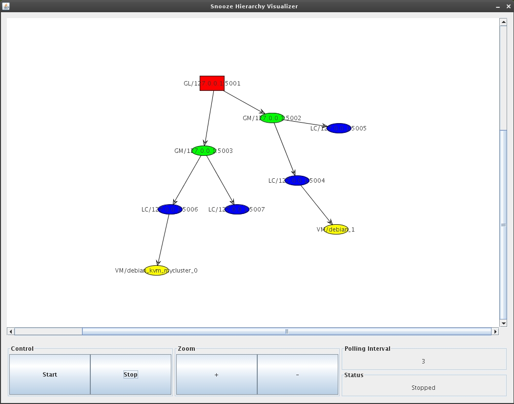

.. _Downloads: http://snooze.inria.fr/download/

Installation of the Command Line Interface (deprecated)
-------------------------------------------------------

This page describes how to install, configure, and use the Snooze command-line interface (CLI). Note that for the time being the CLI installation tutorial is for Debian users only. Still as we also provide the CLI binary, with little efforts you should be able to run it on any distribution after following this tutorial.

Install the client
^^^^^^^^^^^^^^^^^^

Get the latest client Debian package from the Downloads_ page and install it:

::

    ($) dpkg -i snoozeclient_X.X-X_all.deb

Configure the client
^^^^^^^^^^^^^^^^^^^^

Open the client configuration package file */usr/share/snoozeclient/configs/snooze_client.cfg*. It is split into two parts: general and statistics

::

    general.bootstrapNodes = localhost:5000,192.168.0.2:5001
    general.submissionPollingInterval = 6
    general.numberOfMonitoringEntries = 5
    general.dumpOutputFile = /tmp/snooze_tree.xml
    general.graphPollingInterval = 5

    statistics.enabled = false
    statistics.output.format = gnuplot
    statistics.output.file = /tmp/snooze_results.dat

* *General*

The client application requires at least one active bootstrap node in order to discover the current group leader (GL). Consequently it will contact one of the active servers specified in the *general.bootstrapNodes* list to do so. 

The VM submission requests are processed asynchronously in Snooze. The client application submits the requests to the GL and periodically polls it for a reply. The polling interval can be specified using the *general.submissionPollingInterval parameter*.

The client application offers features to retrieve VM monitoring information as well as to visualize the system hierarchy. Therefore, it needs to send requests to the group manages (GMs). The parameter *general.numberOfMonitoringEntries* specifies the number of monitoring entries client requests from the GMs.

Finally the client application offers a feature to dump the hierarchy layout in the GraphML format to the disk. Therefore, the *general.dumpOutputFile* parameter specifies the output file name.

* *Statistics*

Once enabled (*statistics.enabled*) the client application will write statistics (e.g. submission time, number of failed submissions) to the disk. You can specify the statistics output format and the file name using the two parameters: *statistics.output.format*, *statistics.output.file*. Note that currently only GNUPlot output format is implemented.

Control VM life-cycle
^^^^^^^^^^^^^^^^^^^^^

On the shell execute the *“snoozeclient”* command. The following commands are currently supported:

::

      Commands:
          define      Define virtual cluster
          undefine    Undefine virtual cluster
          add         Add virtual machine to the cluster
          remove      Remove virtual machine from the cluster
          start       Start virtual cluster/machine
          suspend     Suspend virtual cluster/machine
          resume      Resume virtual cluster/machine
          shutdown    Shutdown virtual cluster/machine
          destroy     Destroy virtual cluster/machine
          info        Shows virtual cluster/machine information
          list        List virtual clusters
          visualize   Visualize system hierarchy
          dump        Dump system hierarchy

You can display a help for each command by executing “snoozeclient [command] –help“.

We use the notion of virtual cluster (VC) to group together virtual machines (VMs) prior submission on the client side. Consequently, in order to submit VMs you first need to define at least one VC and add some VMs to it. To define a VC execute the following command:

::

    ($) snoozeclient define -vcn myVC

Note that you can always undefine/remove the VC using the *undefine* command.

Contextualize the virtual machines

In order to add VMs to your newly created VC, first disk images and VM templates must be created. Thereby, disk images must be placed on a storage accessible to all the local controllers (LCs), otherwise they can not be located by the LCs during submission. For example, if you are using NFS and the QEMU Copy-on-Write (COW) mechanism you need to go through the following steps: (1) Copy backing file VM image to the mounted storage directory (e.g. /opt/cloud); (2) Create a COW file from the backing file image for each VM; (3) Create and modify the VM template to point to the COW image. 

Please follow the How you can use qemu/kvm base images to be more productive tutorial now to create and install your backing file image (also known as base image).

Now that you have your base image installed, you must configure its networking in order to be reachable to the outside world after submission. Snooze automatically assigns IP addresses to VMs from the system administrator defined VM subnet (see networking settings in the Admin manual) during submission. This is currently done by encoding the assigned IP address into the VMs MAC address. When a VM boots it needs to decode this IP from its MAC address and configure the networking. We use init scripts to accomplish these tasks which will provide different level of contextualization. Choose one of the methods below depending on your needs.

* *Static Contextualization*

If your network parameters (gateway, netmask, nameserver …) are static, read :ref:`static-contextualization`

* *Dynamic Contextualization*

If you need to have more flexibility on your network parameter, read :ref:`dynamic-contextualization` . With this method you will be able to change the network parameters of your virtual machine more easily.

Start the Virtual Machines
^^^^^^^^^^^^^^^^^^^^^^^^^^

The VM can now be added to the VC. Therefore you need to specify the VC name and pass the VM template describing your VM environment. In addition networking capacity constraints can be specified. For example, Snooze can be instructed to cap the VMs network capacity requirements to 10MBit/sec. The following command adds a VM those network capacity is bounded to 10MBit. Note that in case of no network capacity restrictions are given the default value is 100MBit. 

::

    ($) snoozeclient add -vcn myVC -vmt /home/user/vmtemplates/debian1.xml -rx 12800 -tx 12800

Note that you can always remove a VM by simply calling: *snoozeclient remove -vcn myVC -vmn myVM*

You can now either add more VMs and start all of them at once or trigger individual VMs submissions by executing one of the following commands:

::

    ($) snoozeclient start -vcn myVC (starts all VMs belonging to myVC)
    or
    ($) snoozeclient start -vcn myVC -vmn myVM (starts myVM)

If everything went well you should see a similar output.

::

    Name        VM address      GM address   LC address    Status 
    --------------------------------------------------------------
    debian1     192.168.122.5    10.0.0.2    10.0.0.2      RUNNING

Please see the FAQ for possible problem resolutions (e.g. ERRORs in submission). Otherwise use the user mailing list or IRC channel to ask questions.

Finally, the client offers a variety of commands to control the VM execution. For example, it is possible to suspend, resume, shutdown, or destroy VCs/VMs by simply calling:

::

    ($) snoozeclient suspend/resume/shutdown or destroy -vcn myVC (all VMs belonging to myVC)
    ($) snoozeclient suspend/resume/shutdown or destroy -vcn myVC -vmn myVM (only myVM)

Last but not least, VM resource (i.e. CPU, memory, network Rx, network Tx) usage information can be displayed using the info command either for the entire VC or a single VM. You should see a similar output:

::

    Name       CPU     Memory    Rx/Tx         VM           GM         LC         Status
               usage   usage     usage         address      address    address   
    -------------------------------------------------------------------------------------
    debian1    0.09    596992    0.12/0.1  192.168.122.5   10.0.0.2   10.0.0.2   RUNNING

Note that it takes some time to propagate the initial VM monitoring information data. During this time the client will display the “UNKNOWN” message in the usage fields.

System hierarchy visualization and dump
^^^^^^^^^^^^^^^^^^^^^^^^^^^^^^^^^^^^^^^

You can use the client to visualize the current hierarchy state (GL, GMs, LCs, VMs) or dump it in GraphML format to the disk. Visualization requires either a running XServer or X11 forwarding. You can activate visualization by using the appropriate client command:

::

    ($) snoozeclient visualize 

If everything works out a GUI will appear in which you will be able to specify the polling interval and start/stop the visualization process. Moreover, you will be able to zoom in and out the hierarchy state. The polling interval specifies the time period in which the client will request system repository information and redraw the hierarchy. This allows to visualize the system self-organization and healing as well as VM live migrations (e.g. during relocation and consolidation). The following figure shows an example system visualization with one GL, 2 GMs, 4 LCs, and 2 VMs. Each components is represented by its own color (e.g. red for GL). 

